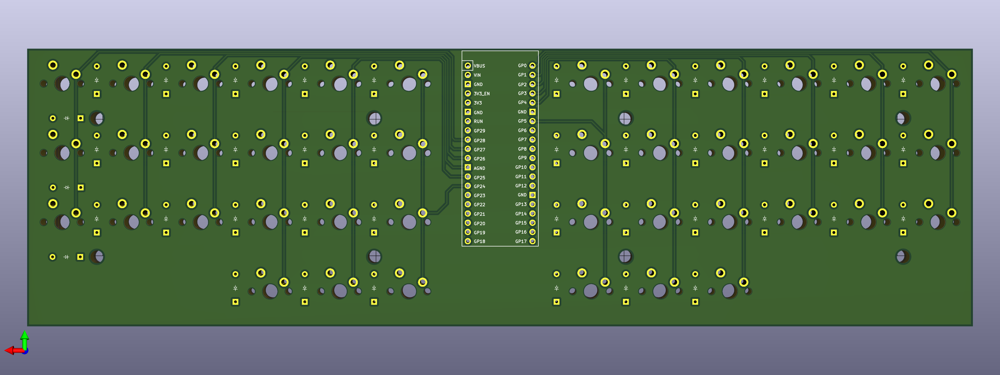
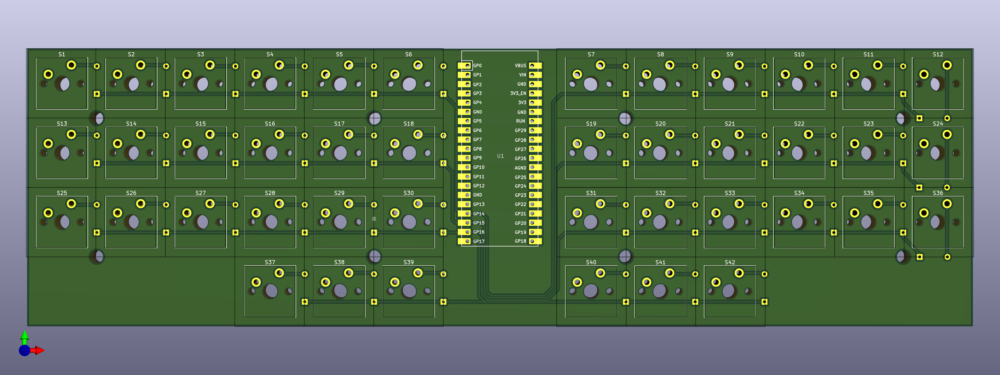
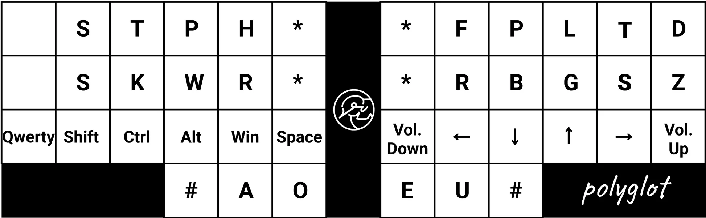
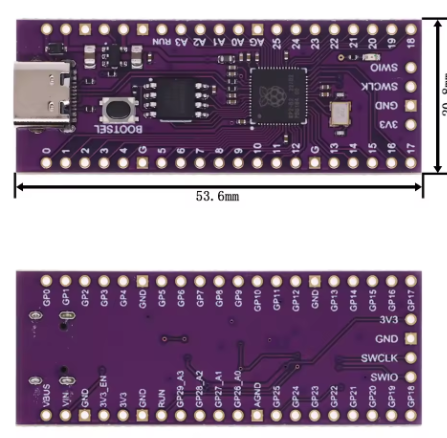

> **⚠️ CRITICAL R1 PCB ISSUE:**
> - **R1 PCBs have a serious design flaw** where one of the columns is routed to the GND pin instead of a GPIO pin.
> - **Manual fix required**: You must manually jump the affected column to pin 23 (GP17) to make the keyboard functional.
> - This issue will be fixed in future revisions. The repository will be updated once R2 PCBs are available.

> **Disclaimer:**
> - **This is a work in progress!**
> - This project is provided as-is, with no guarantees or warranties. Use at your own risk.
> - I am not responsible for any damage, loss, or issues arising from the use, assembly, or modification of these designs.
> - Please verify all information and double-check pinouts, connections, and manufacturing details before proceeding.

# Keebs Project
Welcome to the **Keebs Project**! This is a collection of custom keyboard projects, with a focus on unique, open-source designs for keyboard enthusiasts and makers.

## Featured Project: Polygyatt

**Polygyatt** is a steno + QMK compatible keyboard designed for both stenography and regular typing. It is fully open-source and aims to be accessible for DIY builders and tinkerers.

### Key Features
- **Steno + QMK Compatible**: Use it for stenography or as a regular keyboard.
- **Open Source**: All design files, firmware, and documentation are available.
- **DIY Friendly**: Designed for easy assembly and customization.

### Project Structure
- `polygyatt/PCB/` — KiCad PCB and schematic files
- `polygyatt/QMK/` — QMK firmware and configuration
- `polygyatt/JAVELIN/` — Steno Firmware and configuration

### Images
#### Polygyatt Back

#### Polygyatt Front

---

## Getting Started
1. **Browse the Polygyatt folder** for design files and documentation.
2. **Check out the QMK folder** for firmware and keymap info.
3. **See the production folder** for manufacturing files (BOM, positions, etc).

## License
This project is open source. See individual folders for license details.

## Contributing
Contributions, suggestions, and improvements are welcome! Please open an issue or submit a pull request.

---

For more information, see the `polygyatt/README.md`.

## Credits
This keyboard project is heavily inspired by the [Polyglot Keyboard](https://stenokeyboards.com/products/polyglot-keyboard) by StenoKeyboards. Many design choices and features are based on or adapted from the Polyglot project.

## Silk Screen Attribution
The PCB silk screen art and graphics are credited to their respective creators. If you use or modify the silk screen designs, please retain attribution where possible.

Silk screen art source: [Wormhole Vectors by Vecteezy](https://www.vecteezy.com/free-vector/wormhole)

---

## Note
> ⚠️ **Alert:** This project will **not** be supported on a regular Raspberry Pi Pico, as the pinouts are different from the required configuration.

#### Pico Pinout Reference

## Update
| Date           | Event                  |
|----------------|------------------------|
| 6th July 2025  | PCB protos ordered     |
| 25th July 2025  | PCB has a design flaw where one of the pins is routed to GND and havent tested the pico steno mode since the MCU I have is using a Zetta based flash chip (the official repos supporst Winbond chip)      |